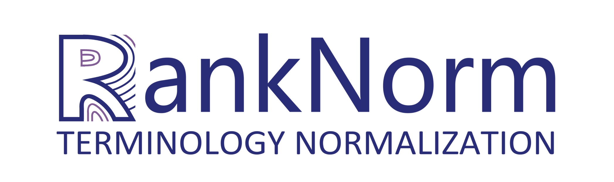

  

# RankNorm: A LLM-based Framework for Biomedical Terminology Normalization in Social Media via Multi-Agent Collaboration (COLING 2025)

## Introduction

A LLM-base Multi-agent Collaboration Framework for Terminology Normalization Task in Social Media following "Recall and Re-rank" framwork.

  

## Dataset

In the repository, we will provide the collated datasets and the generated knowledge cards in [data](https://github.com/JOHNNY-fans/RankNorm/tree/main/data).

In particular, because of the licensing issues involved, you will need to obtain the original dataset (we used the UMLS2017ab and UMLS2023ab version in this paper) from the [UMLS](https://www.nlm.nih.gov/research/umls/licensedcontent/umlsknowledgesources.html) website yourself and convert it via script in [src](https://github.com/JOHNNY-fans/RankNorm/tree/main/src) to end up with a usable dataset.

## Citation
Thank you for your interest, if you use this project, please give us a 🌟 and cite the following paper: (To be continued~)
